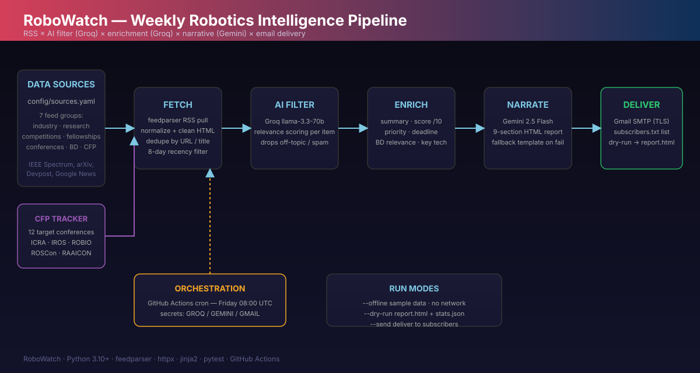

# 🤖 RoboWatch — AI-Powered Robotics Intelligence Digest

[](https://github.com/sajid510/robowatch/actions/workflows/tests.yml)
[](https://github.com/sajid510/robowatch/actions/workflows/weekly_report.yml)
[](LICENSE)
[](requirements.txt)

An AI pipeline that turns raw RSS feeds into a **curated, prioritized robotics
intelligence briefing** — every Friday, straight to your inbox.

Built for student robotics teams and researchers who want high-signal robotics
news, competitions, fellowships, and **conference call-for-papers** without the
noise.



---

## ✨ What it does

1. **Fetches** ~40 RSS feeds across 7 categories — industry, research,
   competitions, fellowships, conferences, Bangladesh robotics, and CFP.
2. **Deduplicates** by URL and near-duplicate titles, then keeps only the last 8 days.
3. **AI-filters** every item with **Groq (llama-3.3-70b)** to drop off-topic or
   low-value content.
4. **AI-enriches** survivors with a summary, 1–10 relevance score, priority
   (HIGH/MEDIUM/LOW), deadline, BD-relevance flag, and tech tags.
5. **Tracks target conferences** (ICRA, IROS, ROBIO, ROSCon, RAAICON, …) with a
   dedicated CFP tracker that scores venue fit against your actual robot project.
6. **Narrates** the whole week with **Gemini 2.5 Flash** into a polished
   9-section HTML email — with a deterministic fallback template if the LLM fails.
7. **Delivers** via Gmail SMTP to every address in `subscribers.txt`.
8. **Self-learns every week** — remembers what you've already seen, learns your
   category preferences from feedback (`feedback.txt` / `--feedback`), and
   injects them into the AI filter + narrator so the digest gets more
   personalized over time. Memory persists in the repo, free.

**Sample output:** see [`examples/sample-report.html`](examples/sample-report.html).

---

## 🚀 Quick start

### Local dry-run (no API keys, no email)

```bash
pip install -r requirements.txt

# Offline demo with bundled sample data → writes report.html + stats.json
python -m src.main --offline --dry-run

# Live fetch + AI + dry-run artifacts (no email sent)
GROQ_API_KEY=... GEMINI_API_KEY=... python -m src.main --dry-run

# Real delivery (requires Gmail app password secrets)
GROQ_API_KEY=... GEMINI_API_KEY=... \
GMAIL_ADDRESS=you@gmail.com GMAIL_APP_PASSWORD=xxxx \
python -m src.main --send
```

### Docker

```bash
docker compose up --build robowatch        # offline dry-run by default
docker compose run --rm robowatch --send   # live delivery
```

### GitHub Actions (automatic)

Push the workflow file already in `.github/workflows/weekly_report.yml`, then
add these **repository secrets**:

| Secret | Purpose |
|---|---|
| `GROQ_API_KEY` | Relevance filtering + enrichment (Groq `llama-3.3-70b`) |
| `GEMINI_API_KEY` | Report narrative (Gemini 2.5 Flash) |
| `GMAIL_ADDRESS` | Sender email (needs app password) |
| `GMAIL_APP_PASSWORD` | Gmail app password (2FA must be on) |

The report runs **every Friday 08:00 UTC** and is also uploadable as a GitHub
Actions artifact.

---

## ⚙️ Configuration

| File | Purpose |
|---|---|
| `config/sources.yaml` | RSS feeds grouped by category (add/remove freely) |
| `src/cfp_tracker.py` | `TARGET_CONFERENCES` — venues you want to publish in |
| `src/ai_filter.py` | `FILTER_SYSTEM` — what to keep / discard |
| `src/ai_narrator.py` | `NARRATOR_SYSTEM` — report voice + structure |
| `subscribers.txt` | One email per line; commit to subscribe/unsubscribe |

### Run modes

| Flag | Behaviour |
|---|---|
| `--offline` | Bundled sample data, no network, no API calls |
| `--dry-run` (default) | Write `report.html`, `report.json`, `stats.json` to `--output-dir` |
| `--send` | Deliver the report by email |
| `--max-items N` | Cap the number of items processed |
| `--output-dir DIR` | Destination for dry-run artifacts (default `output/`) |

### Learning flags

| Flag | Behaviour |
|---|---|
| `--memory-file PATH` | Learning-memory JSON path (default `memory/memory.json`) |
| `--feedback "cat:delta,…"` | Teach category preferences inline, e.g. `"research:1,industry:-0.5"` |
| `--no-learn` | Don't persist memory after this run |
| `feedback.txt` | Commit lines like `research,1` — applied on every run |

---

## 🗂 Repository structure

```
robowatch/
├── src/
│   ├── main.py              # CLI + pipeline orchestration (9 steps)
│   ├── fetchers.py          # RSS fetch, dedupe, recency filter
│   ├── ai_filter.py         # Groq relevance filtering
│   ├── ai_enricher.py       # Groq enrichment + CFP-specific analysis
│   ├── ai_narrator.py       # Gemini report narrative
│   ├── fallback_builder.py  # deterministic fallback HTML report
│   ├── cfp_tracker.py       # target-conference tracking + news lookup
│   ├── mailer.py            # email assembly + Gmail SMTP delivery
│   ├── learning.py          # self-learning memory + personalization
│   └── sample_data.py       # offline demo data
├── memory/memory.json       # learned preferences + seen items (auto-committed)
├── feedback.txt             # teach preferences (commit lines like `research,1`)
├── config/sources.yaml      # RSS feed definitions
├── examples/                # generated sample report
├── docs/                    # getting started, deployment, AI pipeline, …
├── architecture/            # system design documents
├── assets/architecture.svg  # pipeline diagram
├── tests/                   # pytest suite (50+ tests)
└── Dockerfile               # containerized run
```

---

## 🧪 Testing

```bash
pip install -r requirements.txt pytest
python -m pytest tests/ -q
```

The suite covers fetching/deduplication, recency filtering, AI JSON parsing,
the fallback report builder, email assembly, and a full **offline end-to-end
pipeline** run. CI runs it on Python 3.10–3.12.

---

## 📚 Documentation

- [Documentation index](docs/README.md)
- [Getting started](docs/01-getting-started.md) · [Installation](docs/02-installation.md) · [Quick start](docs/03-quick-start.md)
- [Self-learning & personalization](docs/16-self-learning.md)
- [Architecture](architecture/01-system-overview.md) · [Data flow](architecture/03-data-flow.md)
- [AI pipeline](docs/11-ai-pipeline.md) · [CFP tracking](docs/08-workflows.md) · [Email report](docs/10-email-report.md)
- [Deployment](docs/09-deployment.md) · [Troubleshooting](docs/14-troubleshooting.md)

---

## 🔒 Security

- API keys come **only** from environment variables / GitHub secrets — never
  hardcoded.
- The pipeline degrades gracefully: missing keys → structured fallback, no crash.
- Gmail uses SMTP/SSL with an app password scoped to the account.
- See [`SECURITY.md`](SECURITY.md) and [`docs/14-troubleshooting.md`](docs/14-troubleshooting.md).

---

## 📜 License

MIT — see [`LICENSE`](LICENSE). Please cite with [`CITATION.cff`](CITATION.cff)
if you use RoboWatch in research.
